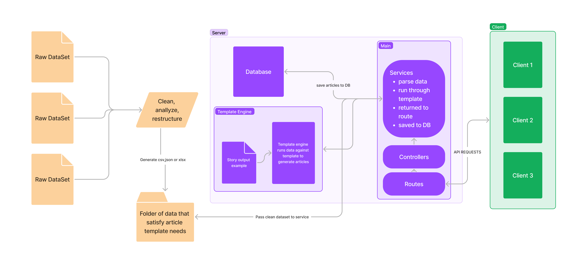

<p align="center">
  <a href="" rel="noopener">
 </a>
</p>

<h1 align="center">PROJECT NUBIA</h1>

<div align="center">

[]()
[](https://github.com/Dataphyte/Nubia-server/issues)
[](https://github.com/Dataphyte/Nubia-server/pulls)
[](/LICENSE)

</div>

---

<p align="center"> Nubia is an open-source project that aims to generate stories 
    <br> 
</p>

## 📝 Table of Contents

- [About](#about)
- [Getting Started](#getting_started)
- [Deployment](#deployment)
- [Usage](#usage)
- [Built Using](#built_using)
- [Contributing](../CONTRIBUTING.md)
- [Authors](#authors)
- [Acknowledgments](#acknowledgement)

## 🧐 About <a name = "about"></a>

Write about 1-2 paragraphs describing the purpose of your project.

## 🏁 Getting Started <a name = "getting_started"></a>

These instructions will get you a copy of the project up and running on your local machine for development and testing purposes.

### Prerequisites

What things you need to install the software and how to install them.

> VScode
> NodeJs

### Installing

A step by step series of examples that tell you how to get a development env running.

1. Install all packages

```javascript
// install all packages
yarn;
```

2. set up .env from .env.example

```javascript
// In the terminal
// copy files in .env.example to a new file '.env'
cp.env.example.env;
```

3. Start dev server

```javascript
yarn run dev
```

4. To generate documentation from JsDoc

```javascript
yarn run gen-docs
```

End with an example of getting some data out of the system or using it for a little demo.

## 🔧 Running the tests <a name = "tests"></a>

Explain how to run the automated tests for this system.

### Break down into end to end tests

Explain what these tests test and why

```
Give an example
```

### And coding style tests

Explain what these tests test and why

```
Give an example
```

## 🎈 Usage <a name="usage"></a>

Add notes about how to use the system.

## 🚀 Deployment <a name = "deployment"></a>

Add additional notes about how to deploy this on a live system.

## ⛏️ Built Using <a name = "built_using"></a>

- [MongoDB](https://www.mongodb.com/) - Database
- [Express](https://expressjs.com/) - Server Framework
- [VueJs](https://vuejs.org/) - Web Framework
- [NodeJs](https://nodejs.org/en/) - Server Environment

## ✍️ Authors <a name = "authors"></a>

- [@oddFEELING](https://github.com/oddFEELING) - Technical fellow from Dataphyte

See also the list of [contributors](https://github.com/kylelobo/The-Documentation-Compendium/contributors) who participated in this project.

## 🎉 Acknowledgements <a name = "acknowledgement"></a>

- Hat tip to anyone whose code was used
- Inspiration
- References
